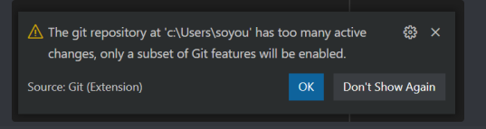

## Git 실습

## 0. 사전 설정(PC 최초 한번하기)

> GitHub ID 부분과 Email을 반드시 여러분의 정보로 써주세요

```python
$ git config --global user.name 'GitHub ID'
$ git config --global user.email 'GitHub Email'
```


## 1. 바탕화면에 TIL 폴더를 만든다.

* TIL 폴더를 열어서 마크다운 정리 파일을 옮긴다.
* 마우스 우클릭
* VS code를 연다.
* New terminal 클릭


## 2. TIL 폴더에 git 저장소를 만들어준다.


```python
$ git init
Initialized empty Git repository in C:/Users/hphk/Desktop/TIL/.git/
(master) $
```


## 3. 커밋을 만든다

```python
$ git status
On branch master
No commits yet
Untracked files:
(use "git add <file>..." to include in what will be committed)
"\353\247\210\355\201\254\353 in what will be
c\213\244\354\232\264.assets/"
"\353\247\210\355\201\254\353\213\244\354\232\2\213\244\354\232\264.md"
\213\244\354\232\2
nothing added to commit but untracked files present (use "git add" to track)
```

```python
$ git add .
$ git commit -m '마크다운 정리'
```

```python
$ git log
commit bff0a8172c2eaabbeba403b34a7848f039bd0ddc (HEAD -> master)
Author: kdt-live <kdt-live@hphk.kr>
Date: Tue Jul 5 16:18:07 2022 +0900
마크다운 정리
$ git status
On branch master
nothing to commit, working tree clean
```

## 주의사항

* git init 할 때 desktop에 .git 숨김 폴더 만들지 않아야 한다. 그렇지 않으면 바탕화면에 새로 만든 폴더가 git init을 하지 않았음에도 불구하고 (master)가 되어 있기 때문이다.
* 만약 desktop에 git init을 한 경우 바탕화면에 있는 숨김 .git 폴더를 지워야 한다.(바탕화면 하위폴더들을 모두 git이 관리하는 상황!)
* git 저장소 내부에서 git 저장소 init은 하면 안된다.
* 명령어 입력할 때마다 경로 꼭 확인하기!


## 다시 정리

* git add . 을 하게 되면 해당 디렉토리의 모든 파일을 staging area로 보낸다는 의미

* touch는 파일 생성 명령어. 파일을 각각 하나씩 add할 수 있음. 전체는 add .

* $는 git bash에서 명령 입력하는 곳

* gitHub 아이디와 이메일 잘못 설정한 경우
  + git config --unset --global user.name로 제거하고
  + git config --global user.name "설정하실 닉네임"으로 바꾸기
  + 하지만, 전체 설정을 바꾸는 것은 위 방법이 맞지만 커밋된 정보는 못 바꾼다
  + 그냥 .git 폴더 지우고 다시 git init 해보자. 물론, add, commit도 다 해야 함
  
* .git 폴더를 CLI로 삭제할 수는 없을까?
  + rm -rf .git (되돌릴 수는 없음)
  + cd ..로 desktop까지 되돌려서 위 명령어 입력
  + (master)가 안보일 때까지 반복
  
* git add 파일명 입력할 때 파일명.md 이런식으로 확장자까지 입력해야 하나?
  + 해당 디렉토리를 **전부 선택**하고 싶을 땐 add . 으로 입력
  
* 삭제 명령어 git rm <filename>

* terminal에 ls -al 치고 .git 파일 있는지 확인해보기

* git 파일 자체를 삭제할거면 rm -rf .git을 하면 되는데 되돌이킬 수 없다

* 바탕화면 desktop 같은 곳에 .git 폴더가 있으면, 즉, 상위폴더에 .git 폴더가 잇으면 해당 폴더 .git 지워도 (master) 나온다

* 커밋하기 전 유저 닉네임과 이메일을 확인하려면 **git config --list**

* 무한 루프나 terminal 빠져나오고 싶으면 **q** , 눌러도 안되면 **esc 누른 후 ":q" 하고 엔터**, 이것도 안되면 **:qa**, 이것도 안되면 **":q!" 친 후 엔터**

* git bash 고정 --> terminal 탭에서 default 로 설정

* cd, 또는 cd .. 명령어 입력시 폴더명에 띄어쓰기가 있으면 '새 폴더' 단순히 이렇게 치면 안됨. '새\폴더' 이렇게 쳐야 하므로, 가급적이면 편의성을 위해 폴더명은 '_'를 쓰자!

* bash에서 Tab 누르면 자동완성 해줌

* 깃허브에 이미 심어진 잔디는 삭제 못하나?

  + 해당 깃 레퍼지토리를 삭제하면 가능하다

* 깃허브 user.name, user.email만 입력하므로, 비밀번호를 입력하는게 아니므로, 로그인을 하는 것이 아니다.

* 해당 문제 발생 시

  

다수 파일이 있는 곳에서 git init을 한 것으로 보임

\[참고]( https://m.blog.naver.com/dnfla420/221822716866)


* git remote add aa url을 할때, aa에 해당하는 이름은 항상 깃허브의 레포지토리와 이름이 같아야 하나?

  + (다른 분 피드백) origin, origin_2, origin_3 다 되었다.

* git push 원격저장소의 이름, 브랜치?이름 이라는건  현재 git init이 설정된 상태에서 git log를 했을때 등록된 버전을 모두 올린다는걸 의미하나? 만약 , 일부버전만 올리고싶다면 어떻게 해야하나?

  + 일부만 **push**하고 싶다면 push하고 싶은 것만 commit 하면 될 것

* git push 취소방법 [링크](ninano1109.tistory.com/3)

* README.md 파일은 왜 만드는 걸까?

  + 만들어두면 차후에 본인이나 다른 유저가 해당 레포지토리 접속 시 파일들 표시되는 부분 아래에 README.md 내용이 표시돼서 그렇다. 그래서 중요한 내용이나 알리고 싶은 것들을 주로 쓰게 된다

  + 동시에 나중에 비밀 레포지토리로 바꿔서 협업하게 될 때 협업 관련 내용들이나 주요 기억해야할 사항을 적을 용도로 쓸 수도 있다.

  + 해당 페이지는 자바스크립트 기반의 유명한 모듈 중 하나인 lodash의 깃헙 레포지토리 페이지인데요 쭉 내려보시면 README.MD 파일에 사용하는 방법이나 왜 써야 하는지, SNS 주소 등등 많은 정보가 담겨 있는 것을 알 수 있습니다. [링크](https://github.com/lodash/lodash)

  

  

  

  

  

  
